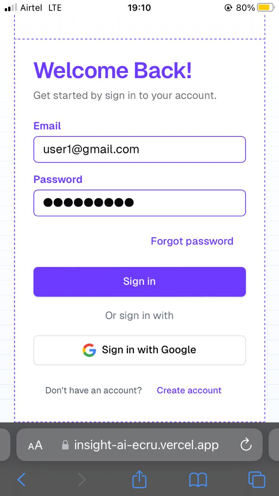
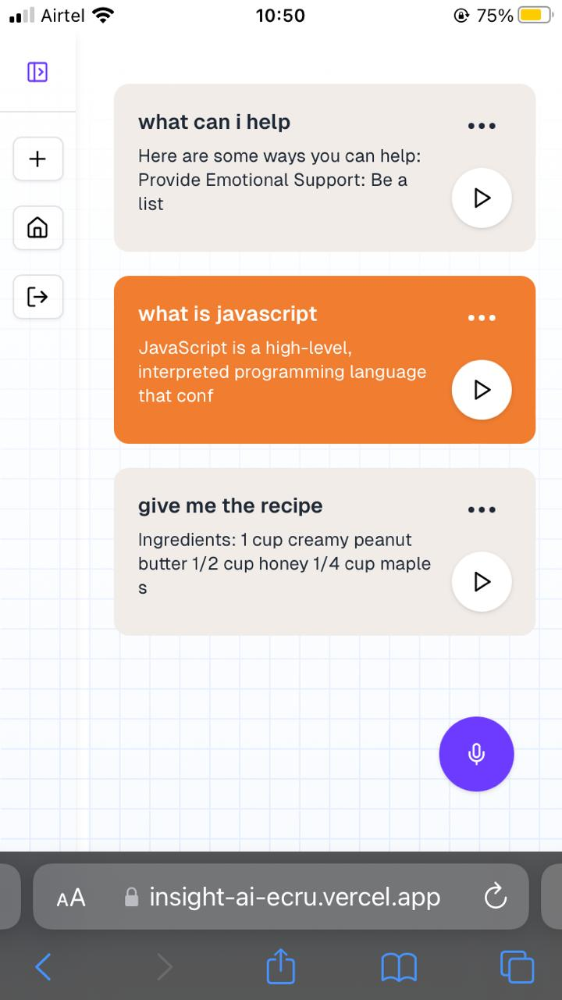
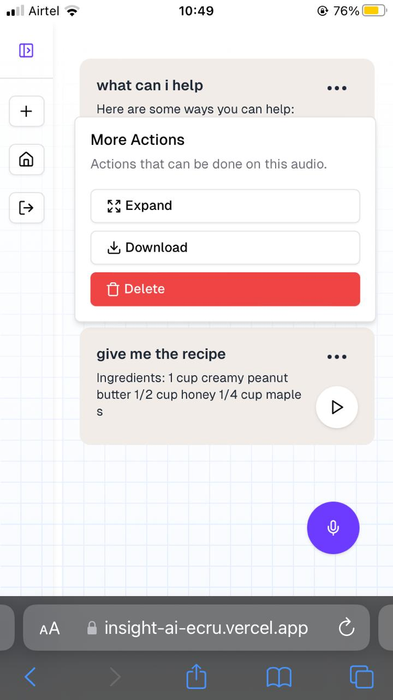

### Insight
Insight is an AI chatbot built in **Nextjs** that allows users to enter prompts using speech rather than text.
It uses **Gemini** under the hood to give back responses with the user can listen to or download a an audio file fo later.

### Why did we chose voice input only rather than both text and voice input
We've noticed a trend in AI chatbot like **ChatGPT** where users interacts with it mainly through text input, this can 
limit people living with low or lack of vision and the elderly. Therefore we chose voice input for **insight**. 
It can be used for assistance with general questions like *What's the recipe of chocolate cake...?* and other genral questions.

We've combine both speech and generative ai to create this program.

### Challenge statetement
We choose the open category of the hackathon.
#### Open category 🌟
    Feeling adventurous? Build anything that combines two or more modalities—go wild with your ideas! Whether it's voice-controlled art generators or AI-powered virtual assistants, the only limit is your imagination.

### Features 🚀
- Speech recognition or input: Using `Web SpeechRecognition`
- Speech output: 
    Using `SpeechSynthesisUtterance` we convert text response to speech (Text-to-speech).
    Using `MediaRecorder` we record it and store it for user to download.

    Why this approach is not compute intensive and cost effective since some processes like text-to-speech is handled on the client side rathen than on the server-side (our side)

- Download audio files: Users would able to store and download audio files of their prompts and responses to later.

- Intelligent: We've integrate insight with **Gemini**, with this integration it can response fast and with nearly
accuracy to the subject matter.


### Demo video
You can view our demo on youtube, [https://youtu.be/zw7Cu6W9YCY](https://youtu.be/zw7Cu6W9YCY)
- Sign in page


- Home page


- How to download a chat as audio


- Short demo video
<video width="640" height="360" style="object-fit: contain;" controls>
  <source src="./docs/short-demo.mp4" type="video/mp4" >
  Your browser does not support the video tag.
</video>


### How to setup and run it locally
1. Ensure you have **Nodejs**, if not download here [https://nodejs.org/en/download/package-manager](https://nodejs.org/en/download/package-manager)

2. Clone this repository
```bash
git clone https://github.com/imrany/insight
```

3. Get into the project and open it with any IDE or code editor, is this we've used **vscode**
```bash
cd insight
code .
```

4. Install all project dependencies
```bash
npm install
```

5. Running the project
```bash 
npm run dev
```

6. Open browser to [http://localhost:3000](http://localhost:3000)

7. You have to **Create an account** by clicking the `Get started` button 
or you can sign in using my credentials
    ```
    email: user1@gmail.com
    password: 12345678
    ```

8. Start by entering a prompt by pressing the `Microphone` button.

9. Once your voice prompt is recorded, you will receive a response which you can play or read by `double tapping` or `expanding` the card.

10. If you need any help, reach out here [imranmat254@gmail.com](mailto:imranmat254@gmail.com)

### Live demo 🌏
Visit [https://insight-ai-ecru.vercel.app](https://insight-ai-ecru.vercel.app)